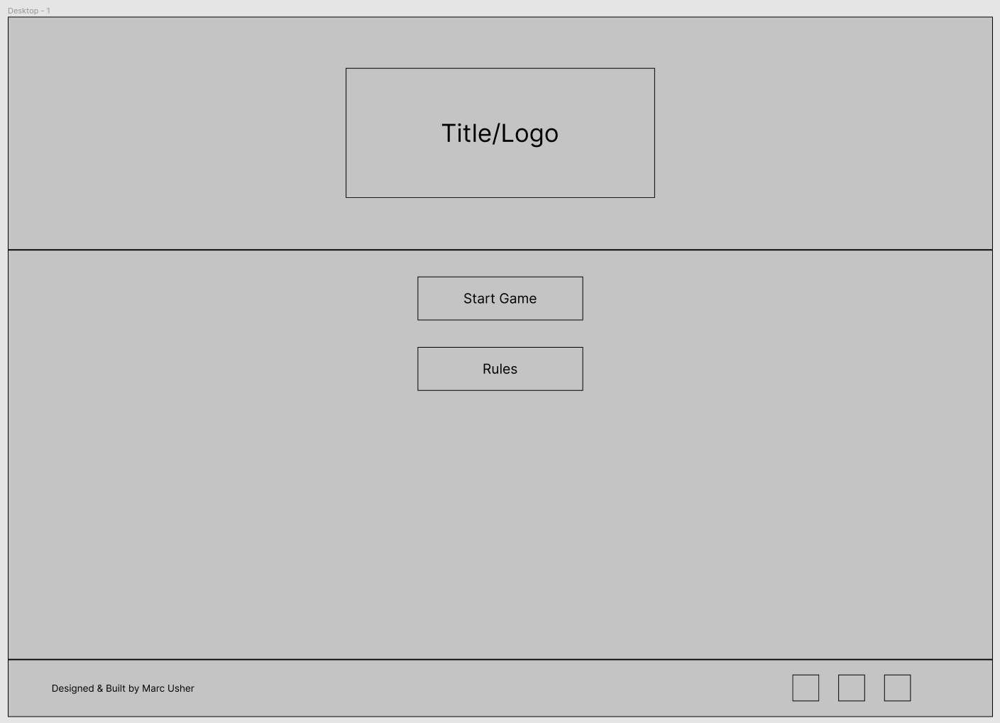
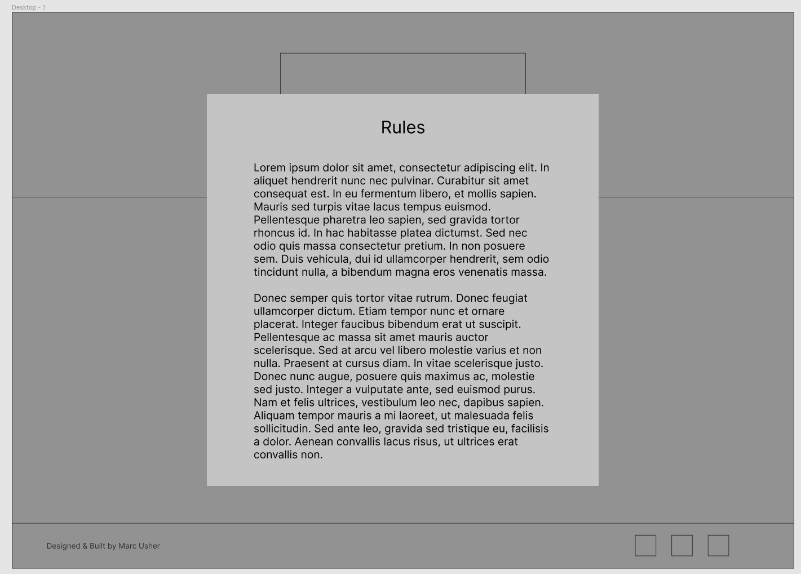
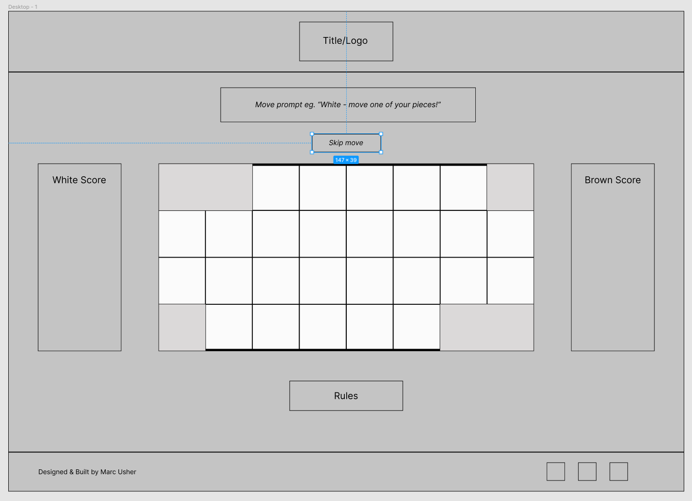
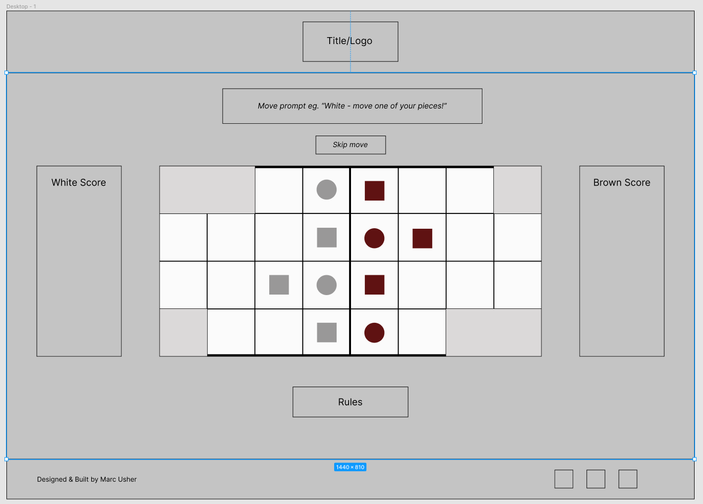
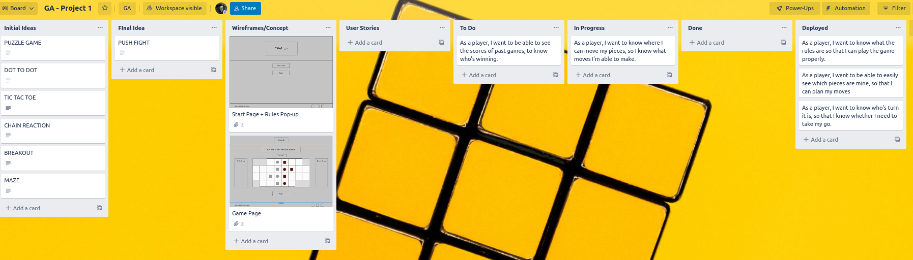
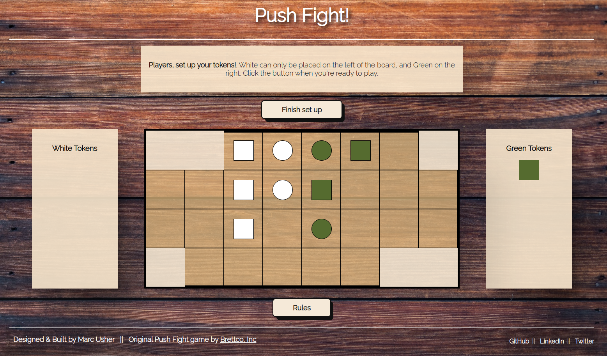
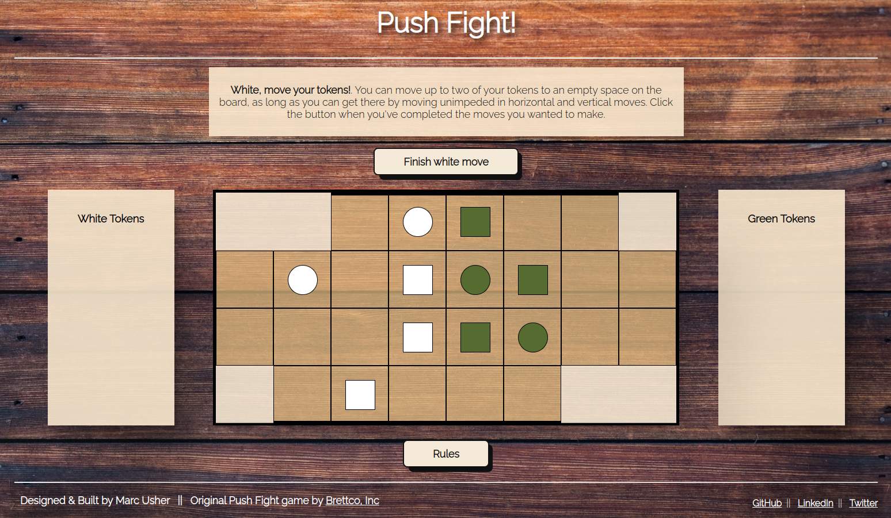

# General Assembly Project 1 - Push Fight

## Table of Contents
* Introduction
   * Brief
   * Project Overview (including screenshots & link to deployed app)
   * Team Members & Timeframe
   * Technologies Used
* Approach Taken
   * User Stories
   * Wireframes
   * Project plan
* Build Process (featured code)
* Final Product
* Conclusions
   * Wins & Challenges
   * Bugs
   * Future Improvements
   * Key Learnings


## Introduction

### Brief

* **Build a web application from scratch**, without a starter codebase
* Use your programming skills to **work out the game logic** for a website
* **Separate HTML, CSS, and JavaScript files** in your application
* **Stick with KISS** (Keep It Simple Stupid) and **DRY** (Don't Repeat Yourself) principles
* **Use JavaScript and/or jQuery** for DOM manipulation
* Build an application **to a specification that someone else gives you**
* **Build a dynamic website that allows two players to compete** from the same computer

### Project Overview - Push Fight

After looking at a number of past projects and researching some online/tabletop games, I decided to try and recreate ['Push Fight'](https://pushfightgame.com/index.htm) by Brettco, Inc.

'Push Fight' is a real-life two-player board game in which players take turns to move their game tokens and try to push the opponent's tokens off the board.


### Deployed App
[Play Push Fight!](https://marcusher.github.io/ga-sei-project1/ )

### Team Members

Individual Project

### Timeframe

1 week

### Technologies Used
* HTML
* CSS, Flexbox
* JavaScript
* jQuery & jQuery UI

## Approach

There were a number of reasons why I thought adapting Push Fight would be a good challenge for this first project:

* The game grid is relatively simple, but there are lots of conditions attached to that grid (only moving on empty spaces, not moving onto other tokens, not pushing off the barriers etc.).
* There are only a small number of tokens for each player, but there are two pieces each with different rules.
* The rules themselves are simple, but still a challenge to code the different turns, restrictions and victory conditions. (In retrospect, this was a huge underestimation of the complexity of creating this game logic...)

### User Stories

I started by creating some User Stories to identify the most crucial features that a player would want when playing this game. This helped to decide on the priorities for the project, with some ideas being 'nice to have', but not essential to playing the game.

* As a player, I want to know what the rules are so that I can play the game properly.
* As a player, I want to be able to easily see which pieces are mine, so that I can plan my moves.
* As a player, I want to know who's turn it is, so that I know whether to take my turn.
* As a player, I want to know where I can move my pieces, so I know what moves I'm able to make.
* As a player, I want to be able to see the scores of past games, to know who's winning.

### Wireframes

I then used Figma to create some wireframes that would best serve these user stories and allow the game to be played easily.

Start page:


Rules pop-up:


Game board:


Game board with tokens:


### Project Plan

I used a Trello board to keep track of my project notes and ideas, the user stories that were in progress, completed or not yet started, and the notes on more specific functionality and tasks that needed to be completed in the HTML, CSS and JavaScript files.




## Process

### Day 1 - Set up and gameplay

I started by setting out the HTML for the main game area, thinking ahead to how I would need to manipulate/identify the various elements and also how I wanted to nest the elements in order to achieve the desired layout. Through the build I added more and more classes in order to identify the different types of grid square and each square’s location on the board.

I then set up the basic CSS, setting properties that gave me the rough layout from my mockups. These properties weren't necessarily the final look for each element, but were added to allow me to easily identify each section of the page.

I added basic tokens for each player, and researched and tested functionality that would allow the players to drag and drop their tokens on the game board.

In this research I found the jQuery UI ‘draggable’ and ‘droppable’ functionality which seemed like it would be a good fit for the gameplay mechanics, so I started to test and implement this. 

On this first day I was able to get the tokens to be picked up and dragged, but I had a few roadblocks for further functionality: 
* Getting the tokens to snap to the squares on the grid (initially I worked around this by making the tokens the same size as a grid square, but later solved this by offsetting the token size - code snippet showing this CSS is below).
* Stopping the tokens from being dropped on a square already containing a token and therefore overlapping that token (this was done using classes to govern where tokens could or couldn’t be dropped, but at this stage the classes were being added removed when the dragged token hovered over a square, rather than when it was placed).
* Only allowing the tokens to be dropped on certain areas of the board (eg. green tokens on the right-hand side of the board during setup).

```
.token {
   display: inline-block;
   border: solid black 1px;
   height: 50px;
   width: 50px;
   z-index: 10;
   cursor: grabbing;
}
 
.token--placed {
   display: block;
   position: absolute;
   margin-left: 25px;
   margin-top: 25px;
}
```

### Day 2 - JavaScript struggles

I started this day by reviewing yesterday's progress and updating my Trello board to track progress on the user stories. I also brainstormed the work that still needed to be done, going through the functionality that still needed to be added and worked through, and prioritised tasks for the day.

I continued to work on the main game logic, integrating this into two functions that are called when a token is picked up or dropped.

The updateGame() function fires when a token is picked up and loops over the grid items the game board for which grid squares have tokens already based on the square’s classes, using the jQuery UI droppable functionality to prevent players from placing tokens there. 

The main game logic was built into this function, with further checks depending on which phase of the game it is (these checks were added during Day 3 - see below for further information).

The tokenDrop() function is called when a token is dropped on a permissible square. It takes the position of the grid square from the square’s classes when the token is dropped and gives the dropped token the same top & left position as the grid square, detaches the token from its previous parent and attaches it to the new grid square, and updates the classes on both elements to clarify that the token has been dropped and the square is now occupied.

### Day 3 - JavaScript progress
On Day 3 I spent a lot of time trying to create the logic that would constrain where a token could be moved during the ‘move’ phase based on the game’s rules but I wasn’t able to get this working.

A token can’t be moved diagonally or through spaces occupied by other tokens, but otherwise can move as many squares as the player wants in as many directions as they want - using the classes on the grid didn’t allow the pick up and drop functions to know if a move was crossing over occupied squares, only if the square the token was dropped on was occupied, and the logic to update this proved too complex, especially as a token could be moved in more than one direction (eg. up, left, down, right, down, left, down right, up) and a player could also select up to two tokens to move during their move phase.

After the end of the day I decided to leave this part of the rules to player honesty and integrate a ‘Finish Setup/Move/Push’ button to allow the game to move to the next phase.

With this decided,I refined the setup() function by moving two key bits of code into there - the `setupDraggables` and `setupDroppables` variables, which use jQuery UI to update which tokens can be picked up and where they can be dropped.

The `enable/disableDroppables()` functions are then also used to disable the jQuery UI ‘droppable’ functionality on squares that are occupied, and enable it on squares that are unoccupied, which solved the problem of tokens being able to drop onto other tokens as this was called and updated each time a token was picked up.

Including them here made it easier to update these rules depending on which phase of the game it is and which player’s turn it is on each click of the ‘Finish Setup/Move/Push’ button, which was added here to allow players to jump to the next phase of play.

Separate turn functions are now called each time the player presses the button to end the current phase, which clear and reset which tokens can be picked up as well as the game prompts for each phase of play. This made it much easier to track the different turns and update the rules order now working correctly with button clicks moving you to the next stage of the game, and looping between move/push/move/push for the two players.

### Day 4 - Final tweaks and styling

On this final day I started to work on the ‘push’ functionality. During a push phase, it would only allow the current player to pick up square tokens and they could only be dropped on occupied adjacent squares.

```
function tokenPush(token, $droppedOn, tokenTeam) {
   if(!token || !$droppedOn || !tokenTeam) {
       console.log('tokenPush isnt being passed all the parameters it needs.');
       return;
   }
   currentGridItem = $droppedOn;
   var droppedTop = $droppedOn.position().top;
   var droppedLeft = $droppedOn.position().left;       
   var droppedRow = $droppedOn.attr('data-row');
   var droppedColumn = $droppedOn.attr('data-column');
 
   // MISSING GAME LOGIC FOR PUSH
  
   $(token).attr('data-row', droppedRow);
   $(token).attr('data-column', droppedColumn);
   $(token).detach().css({position: 'absolute', top: droppedTop, left: droppedLeft}).appendTo($droppedOn);
   $(token).addClass('token--placed');
   $droppedOn.removeClass('grid--unoccupied');
   $droppedOn.addClass('grid--occupied grid--' + tokenTeam);
}
```

Game logic for push phase in the setup() function which updates the enabledDroppables when looping over each grid square:
```
if (game.status === "whitepush" || game.status === "greenpush") {
           if (gridOccupied) { // && adjacent
               $theGridSquare.addClass('grid--occupied');
               $theGridSquare.removeClass('grid--unoccupied');
               // enableDroppables($theGridSquare);
           } else {
               $theGridSquare.removeClass('grid--occupied');
               $theGridSquare.addClass('grid--unoccupied');
               // disableDroppables($theGridSquare);
           }
 
           disableDroppables($theGridSquare);
           // Make sure our current square is enabled
           if (($token.attr('data-row') === $theGridSquare.attr('data-row')) && ($token.attr('data-column') === $theGridSquare.attr('data-column'))) {
               $theGridSquare.removeClass('grid--occupied');
               $theGridSquare.addClass('grid--unoccupied');
               enableDroppables($theGridSquare);
           }
       }
```

The function then also checks for occupied adjacent squares during the push phases:

```
if (game.status === "whitepush" || game.status === "greenpush") {
 
       var grabbedTokenRow = Number($token.attr('data-row'));
       var grabbedTokenColumn = Number($token.attr('data-column'));
       var gridSquareAbove = $('.grid[data-row="' + String(grabbedTokenRow-1) + '"][data-column="' + String(grabbedTokenColumn) + '"]');
       var gridSquareBelow = $('.grid[data-row="' + String(grabbedTokenRow+1) + '"][data-column="' + String(grabbedTokenColumn) + '"]');
       var gridSquareLeft = $('.grid[data-row="' + String(grabbedTokenRow) + '"][data-column="' + String(grabbedTokenColumn-1) + '"]');
       var gridSquareRight = $('.grid[data-row="' + String(grabbedTokenRow) + '"][data-column="' + String(grabbedTokenColumn+1) + '"]');
 
       if (gridSquareAbove.hasClass('grid--occupied')) {
           enableDroppables(gridSquareAbove);
       }
       if (gridSquareBelow.hasClass('grid--occupied')) {
           enableDroppables(gridSquareBelow);
       }
       if (gridSquareLeft.hasClass('grid--occupied')) {
           enableDroppables(gridSquareLeft);
       }
       if (gridSquareRight.hasClass('grid--occupied')) {
           enableDroppables(gridSquareRight);
       }
   }
```
*Note - this code is not DRY at all! With more time I would definitely refactor it, along with a lot of the other code.*

With time running out, I was not able to implement the rest of the push functionality in time that would then push the adjacent tokens (and any others in that row and direction) one square further down.

Once I knew I wouldn’t have time to finish the push functionality (which would be tied to the victory condition checking if a player had a token pushed off the board), I added a ‘Forfeit’ button which would appear only during ‘push’ turns, and would allow a player to forfeit if their token would be pushed off the board.

I then spent the remaining time updating the look and feel of the page and game board. This included the final button styling to add a drop shadow and animation:

```
.button {
   align-items: center;
   background-color: rgb(245, 233, 216);
   border: 2px solid rgb(17, 17, 17);
   border-radius: 8px;
   box-sizing: border-box;
   color: #111;
   cursor: pointer;
   display: flex;
   height: 48px;
   justify-content: center;
   margin: 15px;
   padding: 10px 40px;
   position: relative;
   text-align: center;
   text-decoration: none;
   user-select: none;
   touch-action: manipulation;
 }
  .button:after {
   background-color: rgb(17, 17, 17);
   border-radius: 8px;
   content: "";
   display: block;
   height: 48px;
   left: 0;
   width: 100%;
   position: absolute;
   top: -2px;
   transform: translate(8px, 8px);
   transition: transform .2s ease-out;
   z-index: -1;
 }
  .button:hover:after {
   transform: translate(0, 0);
 }
  .button:active {
   background-color: #ffdeda;
   outline: 0;
 }
  .button:hover {
   outline: 0;
 }
```

I also used the `calc()` function to tidy the layout of the grid, which allowed me to eliminate the very small spacing issues that occurred due to the border thickness.

```
.grid {
   border-color:black;
   border-style: solid;
   border-width: 1px;
   height: calc(25% - 2px);
   width: calc(12.5% - 2px);
}
```
```
.game-board .space {
   background-color: rgba(255, 255, 255, 0.575);
   border-color: rgba(0, 0, 0, 0);
   border-style: solid;
   border-width: 1px;
   height: calc(25% - 2px);
   position: relative;
   width: calc(12.5% - 2px);
```

Finally, I added a subtle sound effect which would play each time a token was picked up and dropped, as this was a stretch goal of the brief:

```
function playSoundDrop() {
   var soundfile = new Audio();
   function playSoundbite(file){
       soundfile = new Audio(file);
       soundfile.play();
   }
   playSoundbite(`audio/drop.wav`);
}
 
function playSoundPickup() {
   var soundfile = new Audio();
   function playSoundbite(file){
       soundfile = new Audio(file);
       soundfile.play();
   }
   playSoundbite(`audio/pickup.wav`);
}
```
My final step was to attempt to tidy up the JavaScript code to include comments outlining what each section does and to remove unnecessary pseudocode or commented out code, unless it was for functionality that wasn’t quite working and I would perhaps return to in future.

## Final Product





## Conclusions

## Wins

* For this first project I worked hard to learn new functionality and methods outside of what we’d been taught, and even though it involved a lot of trial and error I was really proud of how far I was able to take the game.
* A lot of the game logic rests on adding/removing classes to grid squares and tokens, and it was great to crack this and have it work correctly when tokens are picked up and dropped around (with tokens reverting to their original square if dropped on an incorrect square and not affecting the classes of any square or tokens that they were dragged over).
* Originally all the code was in the `updateGame()`, function - it was good to slowly refactor the code and separate out these functions so they could be called when needed. This helped with the game flow, and there is still a lot of refactoring that could be done to tidy this up even more and remove a lot of repetition.

### Challenges

* Overall I definitely picked too complex a game to try and recreate in just 4 days, particularly with the brand new functionality that I decided to try and implement.

* Using the grid as my game object helped in some respects, but not having a game object state in the background that would update based on each player’s moves definitely made it harder to apply game logic to each of the turns.

* I found the jQuery UI documentation quite short on explanation and examples, and it took a lot of trial and error to work out the ins and outs of the functionality I decided to use - if I was to do the game again I might not choose to use the draggable/droppable functionality, as although it did some of what I wanted, adding the more complex game logic to the functionality proved incredibly challenging.

### Bugs

* During the game setup, if you drag a token anywhere other than on the game board, the game breaks.
* The ‘Forfeit’ button appears on the first white move, but should only appear on ‘push’ turns.
* The push functionality is not yet complete - you can drop a square token of your colour onto an adjacent occupied square, but it just overlaps that token and doesn’t push the others in a line.

### Future Improvements 

* Completing the push functionality! I also need to expand the game board by one column on each side to allow tokens to be pushed off all rows horizontally.
* Finalise the logic for the win condition if a token is pushed off the board or if a player is not able to push at all.
* Adding a modal when a player wins, and finalising Forfeit functionality, so that both allow you to reset the game (rather than needing to refresh the page).
* Adding score trackers to the page and allowing wins to be stored in the local storage.
* Generally refactor the code and make it align more with DRY principles.

### Key Learnings

My biggest takeaway from this project was learning the importance of planning a project through from start to finish, and knowing what was essential for the MVP and was just a ‘nice to have’. 

I hugely underestimated the complexity of creating this game after just 2 weeks of the course, and choosing to use completely new functionality from jQuery UI which took me a long time to start getting to grips with meant it took me a lot longer to hit certain goals and hugely delayed a lot of the more complex logic.

I was still pleased to have challenged myself and proud of what I was able to achieve in the time, but it was certainly a bit too ambitious to think I could get this all done in 4 days!